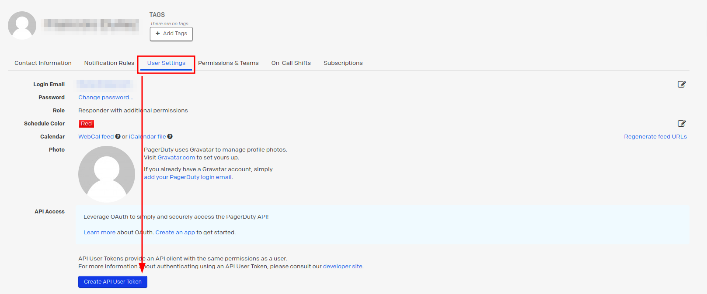

# PagerDuty TUI

PagerDuty TUI is a minimalist terminal user interface developed in Rust for managing incidents in PagerDuty. It provides a simple interface to list triggered incidents, acknowledge them, and open them in your default browser.

## Installation

To install PagerDuty TUI, you can compile it using Cargo, the Rust package manager:

`cargo install pagerduty-tui`

## Configuration

PagerDuty TUI requires a configuration file located at `~/.config/pagerduty_tui.yaml`. This configuration file is used to store your PagerDuty API key, which is necessary for accessing PagerDuty incident data.

### Create Pager Duty API Key

### Configuration File Format

The configuration file should be in YAML format and contain the following key-value pair:
`pagerduty_api_key: <PagerDuty API Key>`

Replace `<PagerDuty API Key>` with your actual PagerDuty API key. This key is required for authenticating requests to the PagerDuty API and accessing incident data.

## Usage

After installation, you can run PagerDuty TUI by executing the following command in your terminal:

`pagerduty-tui`

## Key Bindings

 - `Arrow Up/Down`: Navigate incidents
 - `u`: Update incident list
 - `Enter`: Open incident in default browser
 - `a`: Acknowledge incident
 - `q`: Quit PagerDuty TUI

### Contributions

Contributions to PagerDuty TUI are welcome! If you find any issues or have suggestions for improvements, feel free to open an issue or submit a pull request.
License

This project is licensed under the GNU Affero General Public License v3.0 - see the [LICENSE](LICENSE) file for details.
